# SSAFY10th 구미2반 D203 특화 프로젝트

## 🤑 MoneyGang

## 👨‍🌾 FinFarm 소개

**농산물**에 더 많은 관심을 가질 수 있도록 장려하고, 농산물에 대한 지식을 증진시키며, 농산물의 가치를 재발견하는 것을 목표로 하는 **작물 키우기** **게임**

#### ✨ 기획 의도

농산물에 대한 관심 부족은 국내 농산물 소비 감소와 농촌 경제의 약화로 이어질 수 있습니다. 이 문제를 해결하기 위해, 우리는 농산물에 쉽게 접근하고, 이에 대해 게임, 학습하며 플랫폼을 제공하고자 합니다. 추가적으로 입출금, 대출 등 뱅킹 시스템을 이용해봄으로서 기본적인 은행 구조를 이해할 수 있습니다.

#### ✨ 주요 기능

- **농작물 장터**
  - 농작물 씨앗 구매
  - 농작물 판매
  - 농작물 시세 확인
- **농작물 뱅킹**
  - 개인별 계좌 
    - 계좌내역 조회
    - 이자 지급
  - 대출 및 상환
  - 입출금
  - 송금
- **My 농장**
  - 슬롯 형식 농장 
  - 지력 업그레이드 해서 농작물 생산시간 단축
  - 씨앗 심기
  - 농작물 수확
- **AI 퀴즈**
  - 농산물 데일리 퀴즈 출제 (하루 한 번)

#### ✨ 기대효과

- 농산물에 대한 퀴즈와 게임을 통해, 사용자들의 농산물에 대한 관심을 유도
- 뱅킹 시스템을 이용해보면서 금융 지식, 개인 자산관리 증진
- 농산물에 대한 관심과 지식 증진

⇒ 농산물과 그에 연관된 금융 지식을 익히면서 재미 또한 즐길 수 있습니다.

### 🖥️ FrontEnd 개발 환경

개발언어: Javascript & Typescript 5.4.3

프레임워크 :  React 18.2.0

빌드도구 : Vite 5.2.0

상태관리 : Zustand 4.5.2

CSS 프레임워크: Tailwindcss 3.4.1

### 📖 FrontEnd 라이브러리 및 외부 API 사용

| Name             | Version | License      | Description                                           |
| ---------------- | ------- | ------------ | ----------------------------------------------------- |
| Nivo             | 0.85.1  | MIT          | React로 구축된 데이터 시각화 라이브러리로 시세 차트 데이터 작성을 위한 라이브러리      |
| d3-time-0        | 4.1.0   | BSD-3-Clause | 다양한 날짜와 시간 형식을 파싱하고 서식을 지정을 위한 라이브러리                  |
| react-dom        | 18.2.0  | MIT          | React의 DOM 조작을 지원하기 위한 라이브러리                          |
| react-router-dom | 18.2.0  | MIT          | React 애플리케이션의 라우팅을 관리하기 위한 라이브러리                      |
| react-slick      | 0.30.2  | MIT          | React에서 슬라이드 쇼 및 캐러셀을 구현하는데 사용된 라이브러리                 |
| daisyui          | 4.7.3   | MIT          | Tailwind CSS를 확장하고 구성 요소를 제공하는 UI 라이브러리               |
| eslint           | 8.57.0  | MIT          | JavaScript 및 TypeScript 코드의 문법적 오류 및 코딩 스타일을 검사 라이브러리 |
| prettier         | 3.2.5   | MIT          | 코드 포맷팅 도구로, 코드의 일관된 형식을 유지하고 가독성을 향상을 위한 라이브러리        |
| axios            | 1.6.8   | MIT          | HTTP 클라이언트 라이브러리                                      |
| postcss          | 8.4.37  | MIT          | CSS 후처리 도구로, CSS 파일을 변환하고 최적화하는 라이브러리                 |

### 🖥️ BackEnd 개발 환경

IDE: IntelliJ IDEA 2023.2.5

JDK: Jbr 17 

Spring Boot: 3.2.1

### 📖 BackEnd 라이브러리 및 외부 API 사용

| Name            | Version     | License            |
| --------------- | ----------- | ------------------ |
| Jasypt          | 3.0.4 ver   | Apache License 2.0 |
| Json Web Token  | 0.11.5 ver  | CDDL License 1.0   |
| AWS Cloud       | 2.2.6 ver   | Apache License 2.0 |
| Firebase Admin  | 9.2.0 ver   | Apache License 2.0 |
| Nurigo API      | 4.3.0 ver   | Apache License 2.0 |
| Spring Doc      | 2.0.2 ver   | Apache License 2.0 |
| Spring Security | 6.2.2 ver   | Apache License 2.0 |
| Redis           | 3.2.3 ver   | Apache License 2.0 |
| Lombok          | 1.18.30 ver | MIT License        |

### 🖥️ 공통 스킬

### 💾ERD

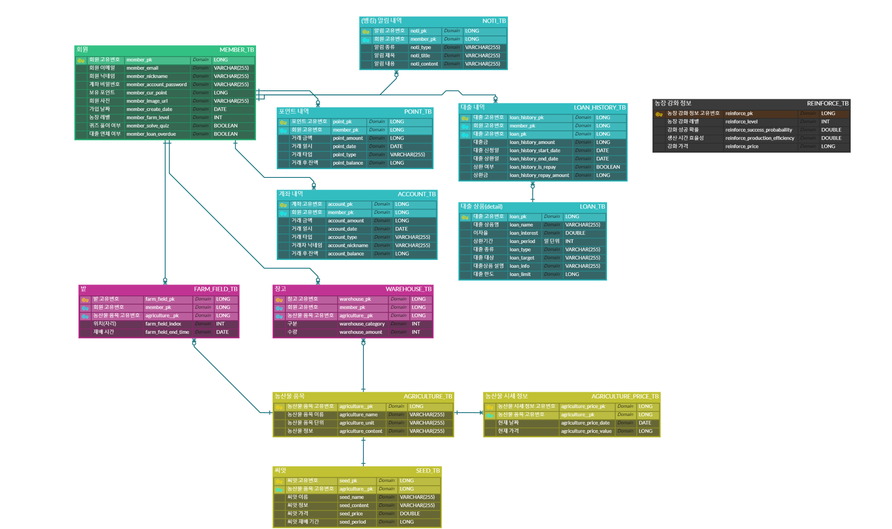

### 🗂시스템 구성도

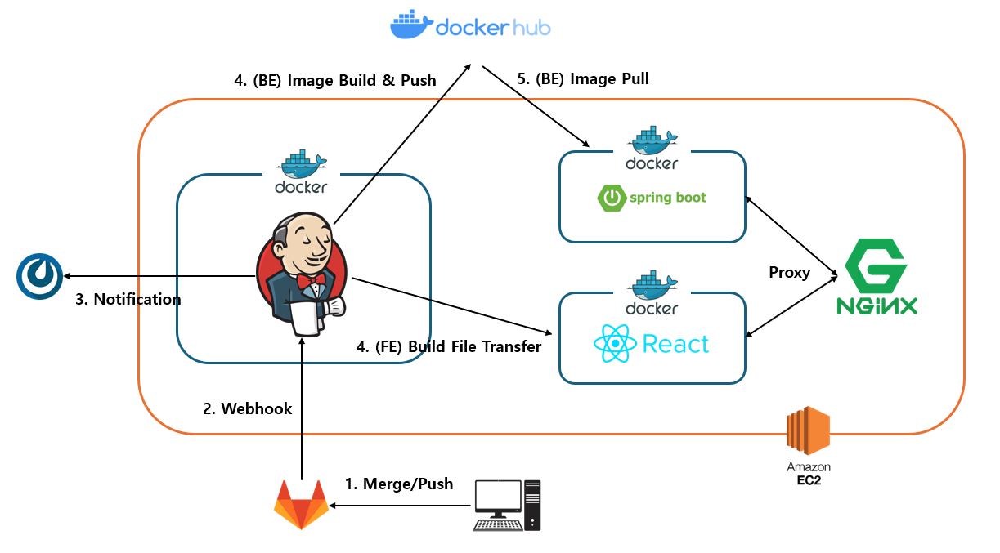

## 📌주요 기능

### 🔎 회원 기능

#### 💡 회원가입

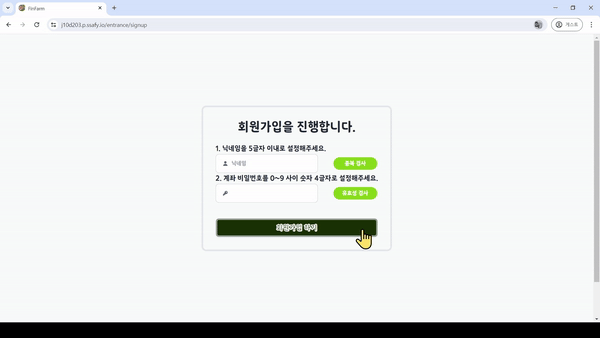

#### 💡 로그인

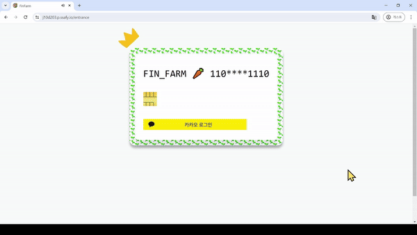

#### 💡 로그아웃

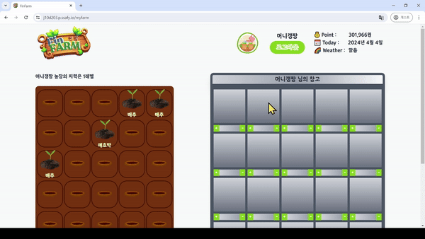

#### 💡 회원 탈퇴

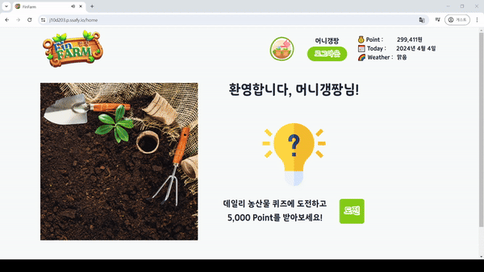

#### 💡 프로필

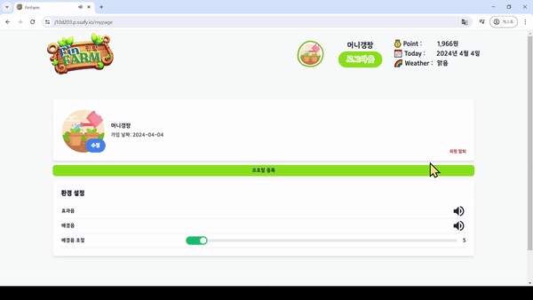

### 🔎 뱅킹 기능

#### 💡 계좌 조회

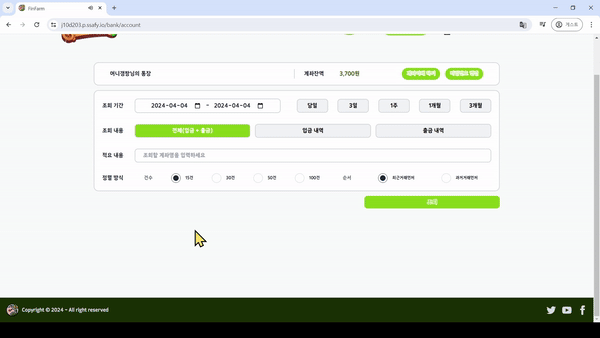

#### 💡 현금 입출금

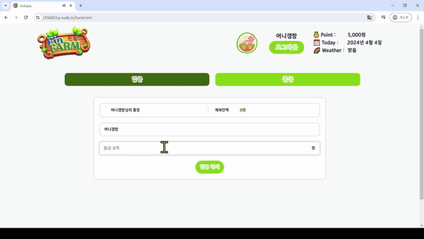

#### 💡 송금

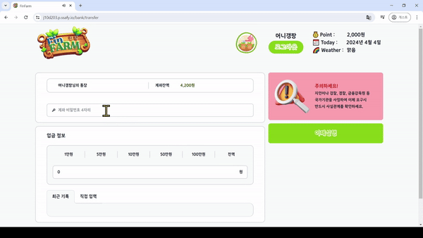

#### 💡 대출

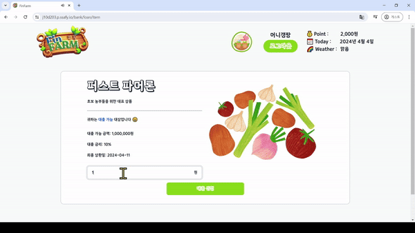

### 🔎 농장 기능

#### 💡 씨앗 심기

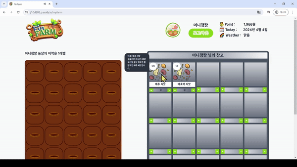

#### 💡 수확

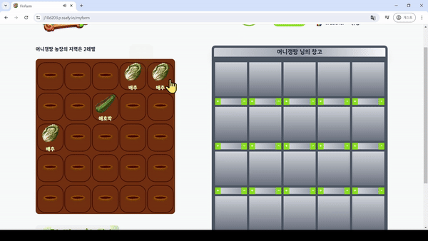

#### 💡 지력 강화

### 🔎 장터 기능

#### 💡 농산물 전체 시세 조회

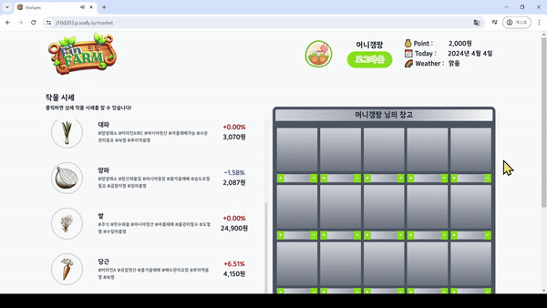

#### 💡 농산물 상세 시세 조회

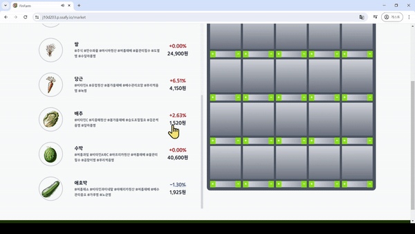

#### 💡 씨앗 구매

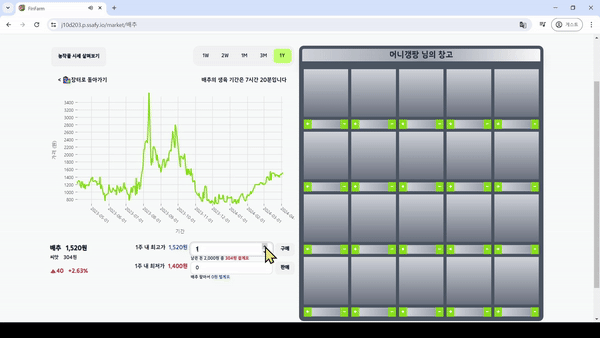

#### 💡 농작물 판매

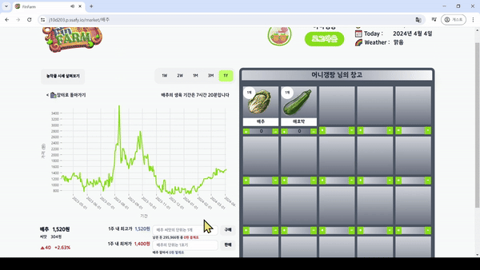

## 😎팀원 소개

|  |  |  |
|:--------------------:|:--------------------:|:--------------------:|
| BE&INFRA             | BE&INFRA             | BE&AI                |
| **👑 이중원**           | **오하빈**              | **홍유준**              |
|  |  |  |
| BE                   | FE                   | FE                   |
| **최재성**              | **최지원**              | **김수빈**              |
